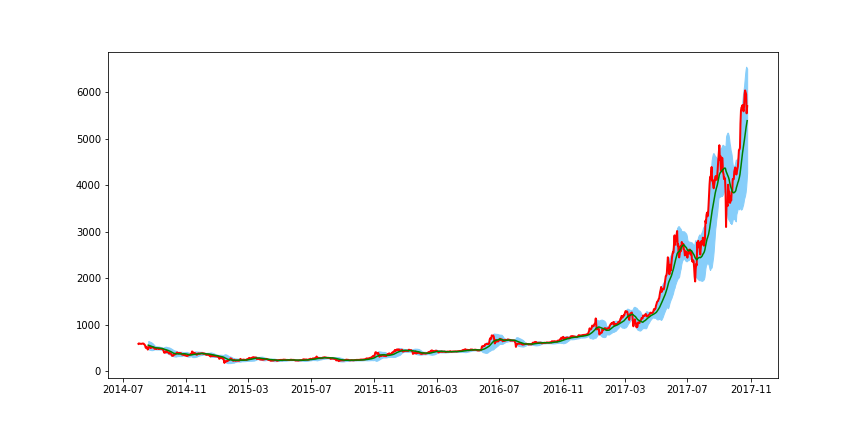

[](http://quantlet.de/)

## [](http://quantlet.de/) **CRIXbtcBB** [](http://quantlet.de/)

```yaml

Name of Quantlet : CRIXbtcBB

Published in : Deep Neural Networks for Cryptocurrencies Price Prediction

Description: Compute Bollinger bands indicator for btc.

Keywords: Bollinger bands, Bitcoin, cryptocurrency

Author : SPILAK Bruno

Submitter : 2018/05/19

Datafile : Data.csv

Output: CRIXbtcBB1
```



### PYTHON Code
```python

import pandas as pd
import matplotlib.pyplot as plt

path = open("Data.csv", "r")
data = pd.read_csv(path,header=0)
data.index = pd.to_datetime(data.Index)
data.drop(data.columns[[0]], axis=1,inplace = True)

train_date = pd.date_range(start = '2014-07-31', end ='2017-03-01', freq='D')
test_date = pd.date_range(start = '2017-03-02', end ='2017-10-25', freq='D')

#Bollinger bands graph
def bollinger(close, window = 20, width = 2):
    ma = close.rolling(window = window).mean()
    sd = close.rolling(window = window).std()
    upper = ma + width*sd
    lower = ma - width*sd
    result = pd.concat([close, ma, upper, lower], axis = 1)
    result.columns = ('close', 'ma_' + str(window), 'upperband_' + str(window), 'lowerband_' + str(window))
    return result

btc = data['btc']
bollingerbands = bollinger(btc, window = 20, width = 2)
upper = bollingerbands['upperband_20']
lower = bollingerbands['lowerband_20']
ma = bollingerbands['ma_20']

fig = plt.figure(figsize=(12,6))
ax = fig.add_subplot(111)
# Get index values for the X axis for facebook DataFrame
x_axis = btc.index
ax.fill_between(x_axis,  upper, lower, color='lightskyblue')
# Plot Adjust Closing Price and Moving Averages
ax.plot(x_axis, btc, color='red', lw=2)
ax.plot(x_axis, ma, color='green', lw=1.5)
plt.show()
fig.savefig('CRIXbtcBB1.png')
```

automatically created on 2018-05-28